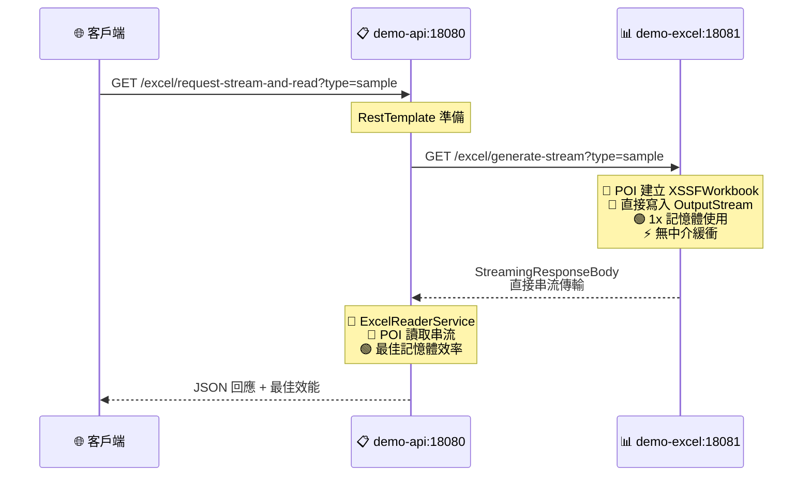

# Docker 部署指南

## 專案概述
這個 workspace 包含兩個 Spring Boot 微服務應用程式：
- **demo-api**: 主要 API 服務，展示兩種 HTTP 客戶端（RestTemplate 和 HttpURLConnection）請求 Excel 檔案並**使用 POI 讀取和分析**
- **demo-excel**: Excel 專用服務，專注於**使用 POI 生成 Excel 檔案**並支援多種回傳方式

## 🎯 架構特色
- **雙 HTTP 客戶端實現**: 
  - **RestTemplate**: Spring 官方推薦的 HTTP 客戶端
  - **HttpURLConnection**: Java 原生 HTTP 客戶端，更底層控制
- **Controller 分離設計**: 
  - `RestTemplateExcelController`: 專門處理 RestTemplate 請求
  - `HttpURLConnectionExcelController`: 專門處理 HttpURLConnection 請求
- **三種效能實作**: byte[]、Resource、StreamingResponseBody
- **完整工作流程**: 包含 Excel 模板建立、上傳填充、讀取驗證的完整流程
- **URL 簡化**: 移除冗餘的 `/excel` 路徑，使用 `/resttemplate` 和 `/urlconnection` 前綴區分

## 核心工作流程 🔄

### 基本流程（RestTemplate / HttpURLConnection）
1. **demo-api** 向 **demo-excel** 發送請求
2. **demo-excel** 使用 **Apache POI** 生成 Excel 檔案（包含 10 筆員工資料）
3. **demo-excel** 將 Excel 檔案回傳給 **demo-api**
4. **demo-api** 使用 **Apache POI** 讀取和分析內容
5. **demo-api** 回傳完整的分析結果

### 進階流程（Excel 模板填充）
1. **demo-api** 使用 POI 建立只有標題列的 Excel 模板
2. **demo-api** 通過 HttpURLConnection 以 multipart/form-data 上傳到 **demo-excel**
3. **demo-excel** 接收 Excel，使用 POI 寫入 10 筆 SAMPLE_DATA
4. **demo-excel** 使用 StreamingResponseBody 串流回傳填充後的 Excel
5. **demo-api** 讀取並驗證 Excel 內容（標題列和資料行）

## 核心功能
- 🔄 **簡潔微服務架構**: 專注於核心 Excel 處理工作流程
- 📊 **Excel 處理**: 使用 Apache POI 進行 Excel 檔案生成與讀取
- 🔥 **熱重載開發**: 程式碼即時修改無需重啟容器
- 🐳 **Docker 容器化**: 完整的開發和生產環境支援
- ⚡ **三種效能實作**: 提供不同記憶體和效能特性的 Excel 傳輸方式
- 🧪 **專注功能**: 移除冗余端點，專注核心工作流程

## 前置需求
- Docker Desktop
- Docker Compose
- 至少 4GB 可用記憶體（Maven 依賴下載需要）
- VS Code（推薦，支援熱重載開發）

## 技術棧
- **Java 17** (Eclipse Temurin)
- **Spring Boot 3.5.6**
- **Apache POI 5.2.5** (Excel 處理)
- **Spring DevTools** (熱重載)
- **Docker & Docker Compose**
- **Alpine Linux** (容器基礎)

## 快速開始 🚀

### 一鍵啟動（推薦）
```bash
# 開發模式（支援熱重載）
docker compose -f docker-compose.dev.yml up -d --build

# 測試服務是否正常
curl http://localhost:18080/
curl http://localhost:18081/
```

### 測試核心功能
```bash
# 1. RestTemplate 基本測試
curl "http://localhost:18080/resttemplate/request-and-read?type=sample" | jq

# 2. HttpURLConnection 完整工作流程測試
curl "http://localhost:18080/urlconnection/generate-and-read-sample" | jq

# 3. 查看所有可用端點
curl http://localhost:18080/ | jq
```

### 停止服務
```bash
docker compose -f docker-compose.dev.yml down
```

## 建置與運行

### 方法 1: 開發模式 - 即時程式碼修改 (推薦開發時使用)

使用開發模式的 Docker Compose，支援程式碼即時修改：
```bash
docker compose -f docker-compose.dev.yml up --build
```

背景執行開發模式：
```bash
docker compose -f docker-compose.dev.yml up -d --build
```

停止開發模式：
```bash
docker compose -f docker-compose.dev.yml down
```

### 方法 2: 生產模式 - 使用 Docker Compose

同時建置並啟動兩個應用程式：
```bash
docker compose up --build
```

背景執行：
```bash
docker compose up -d --build
```

停止所有服務：
```bash
docker compose down
```

查看日誌：
```bash
# 所有服務
docker compose logs -f

# 特定服務
docker compose logs -f demo-api
docker compose logs -f demo-excel
```

### 方法 3: 個別建置 Docker Image

建置 demo-api：
```bash
cd demo-api
docker build -t demo-api:latest .
```

建置 demo-excel：
```bash
cd demo-excel
docker build -t demo-excel:latest .
```

執行容器：
```bash
# demo-api (port 18080)
docker run -d -p 18080:8080 --name demo-api demo-api:latest

# demo-excel (port 18081)
docker run -d -p 18081:8080 --name demo-excel demo-excel:latest
```

## 訪問應用程式

### 服務端點

#### Demo API 服務 (http://localhost:18080)
- `GET /` - 服務首頁，顯示所有可用端點

**RestTemplate 端點** (`/resttemplate` 前綴):
- `GET /resttemplate/request-and-read?type=sample|report` - 使用 ResponseEntity<byte[]>
- `GET /resttemplate/request-resource-and-read?type=sample|report` - 使用 ResponseEntity<Resource>
- `GET /resttemplate/request-stream-and-read?type=sample|report` - 使用 StreamingResponseBody

**HttpURLConnection 端點** (`/urlconnection` 前綴):
- `GET /urlconnection/request-stream-and-read?type=sample|report` - 使用串流方式讀取
- `GET /urlconnection/generate-and-read-sample` - 完整工作流程：建立模板 → 上傳填充 → 讀取驗證

#### Demo Excel 服務 (http://localhost:18081)
- `GET /` - 服務首頁

**Excel 生成 API**:
- `GET /excel/generate-bytes?type=sample|report` - 回傳 ResponseEntity<byte[]>
- `GET /excel/generate-resource?type=sample|report` - 回傳 ResponseEntity<Resource>
- `GET /excel/generate-stream?type=sample|report` - 回傳 StreamingResponseBody

**Excel 填充 API**:
- `POST /excel/fill-data` - 接收 Excel 模板（multipart/form-data），填充 SAMPLE_DATA 後回傳

### Excel 資料內容
- **sample**: 員工資料表
  - 標題列: ID, 姓名, 部門, 薪資, 入職日期, 狀態
  - 10 筆員工記錄（張三、李四、王五...等）
- **report**: 財務報表（收入、支出、利潤等統計資料）

## 兩種 HTTP 客戶端比較 🔧

### RestTemplate vs HttpURLConnection

| 特性 | RestTemplate | HttpURLConnection |
|------|-------------|-------------------|
| **抽象層級** | 高階（Spring 封裝） | 低階（Java 原生） |
| **易用性** | ✅ 簡單易用 | ⚠️ 需要手動處理細節 |
| **依賴** | Spring Framework | JDK 內建 |
| **錯誤處理** | 自動處理，拋出 RestClientException | 需手動檢查狀態碼 |
| **類型轉換** | 自動序列化/反序列化 | 手動處理 byte[] |
| **連接管理** | 自動連接池管理 | 需手動管理連接 |
| **適用場景** | Spring Boot 應用 | 無 Spring 環境、需要底層控制 |
| **學習曲線** | 平緩 | 陡峭 |
| **控制力** | 中等 | 完全控制 |

### RestTemplate 優勢
```java
// 簡潔的程式碼
ResponseEntity<byte[]> response = restTemplate.exchange(
    url, HttpMethod.GET, entity, byte[].class
);
byte[] excelData = response.getBody();
```
- ✅ 程式碼簡潔明瞭
- ✅ 自動處理 HTTP 標頭
- ✅ 內建重試和錯誤處理
- ✅ 與 Spring 生態系統整合良好

### HttpURLConnection 優勢
```java
// 完全控制的程式碼
HttpURLConnection connection = (HttpURLConnection) url.openConnection();
connection.setRequestMethod("POST");
connection.setRequestProperty("Content-Type", "multipart/form-data");
// ... 手動處理所有細節
```
- ✅ 無需額外依賴
- ✅ 完全控制 HTTP 請求細節
- ✅ 適合複雜的 multipart/form-data 上傳
- ✅ 更適合理解 HTTP 協議底層運作

### 使用建議
- **使用 RestTemplate**: 大多數標準的 REST API 呼叫
- **使用 HttpURLConnection**: 需要精細控制 HTTP 請求、複雜的檔案上傳、無 Spring 環境

## 三種 Excel 處理方式比較 📊

### 方式一：ResponseEntity<byte[]>
```java
// demo-excel 端
public byte[] generateSampleExcel() {
    ByteArrayOutputStream outputStream = new ByteArrayOutputStream();
    workbook.write(outputStream);
    return outputStream.toByteArray();  // 轉為 byte[]
}

// demo-api 端
ResponseEntity<byte[]> response = restTemplate.exchange(...);
byte[] excelData = response.getBody();
```

**特點**:
- ✅ **實作簡單**: 最直接的方式，容易理解
- ✅ **小檔案效能佳**: 檔案 < 10MB 時效能最好
- ❌ **記憶體消耗高**: 4x 記憶體使用 (Workbook + OutputStream + byte[] + 傳輸)
- ❌ **大檔案風險**: 可能導致 OutOfMemoryError
- 🎯 **適用場景**: 小型 Excel 檔案 (< 10MB)

### 方式二：ResponseEntity<Resource>
```java
// demo-excel 端
public ByteArrayOutputStream generateSampleExcelAsStream() {
    ByteArrayOutputStream outputStream = new ByteArrayOutputStream();
    workbook.write(outputStream);
    return outputStream;  // 直接返回 OutputStream
}

// demo-api 端
ByteArrayResource resource = new ByteArrayResource(outputStream.toByteArray());
ResponseEntity<Resource> response = ResponseEntity.ok()
    .contentLength(resource.contentLength())
    .header(HttpHeaders.CONTENT_DISPOSITION, "attachment; filename=\"report.xlsx\"")
    .body(resource);
```

**特點**:
- ✅ **更好的 HTTP 標頭支援**: Content-Length, Content-Disposition 等
- ✅ **標準化**: 符合 Spring 資源處理模式
- ⚠️ **記憶體使用相同**: 仍然是 4x 記憶體使用
- ✅ **更好的錯誤處理**: Resource 介面提供更多元數據
- 🎯 **適用場景**: 中型 Excel 檔案 (10-50MB)，需要標準 HTTP 標頭

### 方式三：StreamingResponseBody (最佳實踐)
```java
// demo-excel 端
public void generateSampleExcelToStream(OutputStream outputStream) {
    workbook.write(outputStream);  // 直接寫入外部 OutputStream
    workbook.close();
}

// demo-api 端
StreamingResponseBody stream = outputStream -> {
    excelService.generateSampleExcelToStream(outputStream);
};
ResponseEntity<StreamingResponseBody> response = ResponseEntity.ok()
    .contentType(MediaType.APPLICATION_OCTET_STREAM)
    .body(stream);
```

**特點**:
- ✅ **記憶體效率最高**: 1x 記憶體使用，直接串流傳輸
- ✅ **大檔案友善**: 無檔案大小限制
- ✅ **併發性佳**: 支援高併發請求
- ✅ **無中介記憶體**: 避免多次記憶體分配
- ⚠️ **實作複雜**: 需要理解串流概念
- 🎯 **適用場景**: 大型 Excel 檔案 (> 50MB)，高併發環境

### 效能比較表格

| 特性 | ResponseEntity<byte[]> | ResponseEntity<Resource> | StreamingResponseBody |
|------|----------------------|-------------------------|---------------------|
| **記憶體使用** | 4x (最高) | 4x (高) | 1x (最低) |
| **網路開銷** | 相同 | 相同 | 相同 |
| **實作難度** | 簡單 | 中等 | 複雜 |
| **HTTP 標頭支援** | 基本 | 完整 | 完整 |
| **大檔案支援** | ❌ | ⚠️ | ✅ |
| **併發性能** | 低 | 中 | 高 |
| **建議檔案大小** | < 10MB | 10-50MB | > 50MB |

### 記憶體使用詳解

**ResponseEntity<byte[]> / ResponseEntity<Resource>**:
```
記憶體流程: Workbook → ByteArrayOutputStream → byte[] → Resource/Response = 4x 記憶體
```

**StreamingResponseBody**:
```
記憶體流程: Workbook → 直接串流輸出 = 1x 記憶體
```

### 效能測試指令

測試所有三種方式：
```bash
# 方式一：ResponseEntity<byte[]>
curl "http://localhost:18080/excel/request-and-read?type=sample"

# 方式二：ResponseEntity<Resource>
curl "http://localhost:18080/excel/request-resource-and-read?type=sample"

# 方式三：StreamingResponseBody
curl "http://localhost:18080/excel/request-stream-and-read?type=sample"
```

## 開發模式特色

### 🔥 熱重載功能
開發模式支援程式碼即時修改：
1. 修改任何 `.java` 檔案
2. Spring Boot DevTools 自動偵測變化
3. 應用程式自動重啟（2-4 秒）
4. 瀏覽器重新整理即可看到變更

### 📁 Volume 掛載
```yaml
volumes:
  - ./demo-api:/app          # 本機程式碼同步到容器
  - maven-cache-api:/root/.m2 # Maven 依賴快取
```

### 🛠️ 開發工具整合
- **VS Code**: 安裝 Extension Pack for Java
- **自動編譯**: 檔案儲存後自動編譯
- **即時預覽**: 修改後立即看到效果

## Excel 功能展示

### 🎯 RestTemplate 工作流程測試
```bash
# 方式一：ResponseEntity<byte[]> - 適合小檔案
curl "http://localhost:18080/resttemplate/request-and-read?type=sample"
curl "http://localhost:18080/resttemplate/request-and-read?type=report"

# 方式二：ResponseEntity<Resource> - 適合中檔案，更好的 HTTP 標頭
curl "http://localhost:18080/resttemplate/request-resource-and-read?type=sample"
curl "http://localhost:18080/resttemplate/request-resource-and-read?type=report"

# 方式三：StreamingResponseBody - 適合大檔案，最佳記憶體效率
curl "http://localhost:18080/resttemplate/request-stream-and-read?type=sample"
curl "http://localhost:18080/resttemplate/request-stream-and-read?type=report"
```

### 🔗 HttpURLConnection 工作流程測試
```bash
# 串流方式讀取 Excel
curl "http://localhost:18080/urlconnection/request-stream-and-read?type=sample"
curl "http://localhost:18080/urlconnection/request-stream-and-read?type=report"

# 完整工作流程：建立模板 → 上傳 → 填充 → 讀取 → 驗證
curl "http://localhost:18080/urlconnection/generate-and-read-sample"
```

### 📋 直接測試 demo-excel 服務
```bash
# 直接從 demo-excel 取得 Excel（用於服務間通信）
curl "http://localhost:18081/excel/generate-bytes?type=sample"
curl "http://localhost:18081/excel/generate-resource?type=sample"
curl "http://localhost:18081/excel/generate-stream?type=sample"
```

### 💡 測試回應範例
```bash
# 測試 RestTemplate 員工資料表工作流程
curl "http://localhost:18080/resttemplate/request-and-read?type=sample"

# 預期回應包含：
# - http_client: "RestTemplate"
# - 檔案大小和類型資訊
# - POI 讀取的完整 Excel 內容
# - 工作表結構分析（10 筆員工資料）
# - 資料行列統計

# 測試 HttpURLConnection 完整工作流程
curl "http://localhost:18080/urlconnection/generate-and-read-sample"

# 預期回應包含：
# - workflow: "demo-api creates template → demo-excel fills data → demo-api reads result"
# - http_client: "java.net.HttpURLConnection"
# - headers_validation: "PASSED"
# - expected_headers: ["ID", "姓名", "部門", "薪資", "入職日期", "狀態"]
# - empty_excel_size: 模板大小
# - filled_excel_size: 填充後大小
# - excel_content: 完整的 Excel 內容（標題 + 10 筆資料）
```

### 🎯 測試建議
1. **小檔案測試**: 使用 `type=sample` 測試基本功能
2. **大檔案測試**: 使用 `type=report` 測試效能差異
3. **比較測試**: 分別測試三種方式觀察記憶體使用差異

## 容器管理

查看運行中的容器：
```bash
docker ps
```

停止容器：
```bash
docker stop demo-api demo-excel
```

刪除容器：
```bash
docker rm demo-api demo-excel
```

查看容器日誌：
```bash
docker logs demo-api
docker logs demo-excel
```

重啟特定服務：
```bash
# 僅重啟 demo-api
docker compose -f docker-compose.dev.yml restart demo-api

# 僅重啟 demo-excel  
docker compose -f docker-compose.dev.yml restart demo-excel
```

## 架構說明

### 三種 Excel 處理微服務架構

#### 整體架構概覽
```mermaid
graph TD
    Client[🌐 客戶端]
    
    subgraph "Demo-API (Port 18080)"
        API1[📋 /excel/request-and-read<br/>RestTemplate + ExcelReaderService]
        API2[📋 /excel/request-resource-and-read<br/>RestTemplate + ExcelReaderService]
        API3[📋 /excel/request-stream-and-read<br/>RestTemplate + ExcelReaderService]
    end
    
    subgraph "Demo-Excel (Port 18081)"
        Excel1[📊 /excel/generate-bytes<br/>ExcelService + POI]
        Excel2[📊 /excel/generate-resource<br/>ExcelService + POI]
        Excel3[📊 /excel/generate-stream<br/>ExcelService + POI]
    end
    
    Client --> API1
    Client --> API2
    Client --> API3
    
    API1 -->|🔴 byte[]<br/>4x記憶體| Excel1
    API2 -->|🟡 Resource<br/>4x記憶體+標頭| Excel2
    API3 -->|🟢 Streaming<br/>1x記憶體| Excel3
```

#### 方式一：ResponseEntity<byte[]> - 簡單直接
```mermaid
sequenceDiagram
    participant C as 🌐 客戶端
    participant API as 📋 demo-api:18080
    participant Excel as 📊 demo-excel:18081
    
    C->>API: GET /excel/request-and-read?type=sample
    Note over API: RestTemplate 準備
    API->>Excel: GET /excel/generate-bytes?type=sample
    Note over Excel: 📄 POI 建立 XSSFWorkbook<br/>📝 OutputStream→byte[]<br/>🔴 4x 記憶體使用
    Excel-->>API: ResponseEntity&lt;byte[]&gt;<br/>Excel 檔案 byte[]
    Note over API: 📖 ExcelReaderService<br/>📄 POI 讀取分析<br/>🔴 額外 byte[] 複製
    API-->>C: JSON 回應 + 分析結果
```

#### 方式二：ResponseEntity<Resource> - 標準化支援
```mermaid
sequenceDiagram
    participant C as 🌐 客戶端
    participant API as 📋 demo-api:18080
    participant Excel as 📊 demo-excel:18081
    
    C->>API: GET /excel/request-resource-and-read?type=sample
    Note over API: RestTemplate 準備
    API->>Excel: GET /excel/generate-resource?type=sample
    Note over Excel: 📄 POI 建立 XSSFWorkbook<br/>📝 ByteArrayOutputStream<br/>🟡 4x 記憶體使用<br/>🏷️ Content-Length/Type 標頭
    Excel-->>API: ResponseEntity&lt;Resource&gt;<br/>ByteArrayResource + 完整標頭
    Note over API: 📖 ExcelReaderService<br/>📄 POI 讀取分析<br/>🟡 Resource.getInputStream()
    API-->>C: JSON 回應 + 標準化標頭
```

#### 方式三：StreamingResponseBody - 最佳效能


#### 記憶體使用比較
```mermaid
graph LR
    subgraph "📊 記憶體使用量比較"
        A[🔴 方式一: byte[]]
        B[🟡 方式二: Resource]
        C[🟢 方式三: Streaming]
        
        A --> A1[Workbook + OutputStream<br/>+ byte[] + 傳輸 = 4x]
        B --> B1[Workbook + OutputStream<br/>+ byte[] + Resource = 4x]
        C --> C1[Workbook → 直接串流輸出 = 1x]
    end
    
    style A fill:#ffcccc
    style B fill:#fff3cd
    style C fill:#d4edda
    style A1 fill:#ffcccc
    style B1 fill:#fff3cd
    style C1 fill:#d4edda
```
```
┌─────────────────────────────┐    GET /excel/generate-bytes    ┌─────────────────────────────┐
│        demo-api             │ ──────────────────────────────► │       demo-excel            │
│     (Port 18080)            │                                │     (Port 18081)            │
│                             │ ◄────────────────────────────── │                             │
│ /excel/request-and-read     │       Excel byte[]              │ /excel/generate-bytes       │
│                             │    (4x 記憶體使用)              │   byte[] generateExcel()    │
│ 📋 RestTemplate            │                                │ 📊 ExcelService            │
│ 📖 ExcelReaderService      │                                │ 📄 POI XSSFWorkbook        │
│ 📄 POI 讀取分析            │                                │ 📝 OutputStream→byte[]      │
└─────────────────────────────┘                                └─────────────────────────────┘
```

#### 方式二：ResponseEntity<Resource>
```
┌─────────────────────────────┐   GET /excel/generate-resource  ┌─────────────────────────────┐
│        demo-api             │ ──────────────────────────────► │       demo-excel            │
│     (Port 18080)            │                                │     (Port 18081)            │
│                             │ ◄────────────────────────────── │                             │
│/excel/request-resource-read │    ByteArrayResource            │/excel/generate-resource     │
│                             │   (4x 記憶體+完整標頭)          │ ByteArrayOutputStream       │
│ 📋 RestTemplate            │                                │ 📊 ExcelService            │
│ 📖 ExcelReaderService      │                                │ 📄 POI XSSFWorkbook        │
│ 📄 POI 讀取分析            │                                │ 🏷️  Content-Length/Type    │
└─────────────────────────────┘                                └─────────────────────────────┘
```

#### 方式三：StreamingResponseBody (最佳實踐)
```
┌─────────────────────────────┐    GET /excel/generate-stream   ┌─────────────────────────────┐
│        demo-api             │ ──────────────────────────────► │       demo-excel            │
│     (Port 18080)            │                                │     (Port 18081)            │
│                             │ ◄────────────────────────────── │                             │
│/excel/request-stream-read   │   StreamingResponseBody         │ /excel/generate-stream      │
│                             │    (1x 記憶體直接串流)          │ void writeToStream()        │
│ 📋 RestTemplate            │                                │ 📊 ExcelService            │
│ 📖 ExcelReaderService      │                                │ 📄 POI XSSFWorkbook        │
│ 📄 POI 讀取分析            │                                │ � 直接 OutputStream        │
└─────────────────────────────┘                                └─────────────────────────────┘
```

### Excel 處理流程
1. **demo-excel** 使用 **Apache POI** 建立 Workbook
2. **demo-excel** 生成 Excel 檔案並轉為 byte[]
3. **demo-api** 接收 byte[] 資料
4. **demo-api** 使用 **Apache POI** 讀取 Excel：
   - 解析工作表 (Sheet)
   - 讀取行列資料 (Row, Cell)
   - 分析資料類型和結構
   - 提取完整內容

### 技術架構特點
- **spring-network**: Docker 橋接網路，容器間使用服務名稱通信
- **Volume 掛載**: 支援開發模式熱重載和 Maven 依賴快取
- **Port 映射**: demo-api(18080→8080), demo-excel(18081→8080)
- **簡化設計**: 移除多餘端點，專注核心 Excel 工作流程

## Docker Image 說明

### 開發環境 (Dockerfile.dev)
- **基礎映像**: `eclipse-temurin:17-jdk-alpine`
- **包含工具**: Maven (用於即時編譯)
- **執行方式**: `mvn spring-boot:run` (支援熱重載)
- **Volume 掛載**: 程式碼目錄和 Maven 快取

### 生產環境 (Dockerfile)
- **Multi-stage build**: 
  - Build stage: 使用 JDK 17 編譯應用程式
  - Runtime stage: 使用 JRE 17 Alpine (更小的 image)
- **已包含**: `.dockerignore` 排除不必要檔案
- **最佳化**: 較小的映像檔大小

### 程式碼結構

#### Demo-API 服務（雙 HTTP 客戶端架構）
```
demo-api/src/main/java/com/example/demo_api/
├── DemoApiApplication.java                    # Spring Boot 主程式
├── controller/
│   ├── HomeController.java                   # 首頁，顯示所有端點
│   ├── RestTemplateExcelController.java      # RestTemplate 實現
│   └── HttpURLConnectionExcelController.java # HttpURLConnection 實現
├── service/
│   └── ExcelReaderService.java               # POI Excel 讀取服務
└── config/
    └── RestTemplateConfig.java               # RestTemplate Bean 設定
```

**Controller 職責劃分**:
- `HomeController`: 基本資訊與端點列表
- `RestTemplateExcelController`: 使用 Spring RestTemplate 的三種實現
  - `/resttemplate/request-and-read` (byte[])
  - `/resttemplate/request-resource-and-read` (Resource)
  - `/resttemplate/request-stream-and-read` (StreamingResponseBody)
- `HttpURLConnectionExcelController`: 使用 Java 原生 HttpURLConnection
  - `/urlconnection/request-stream-and-read` (串流讀取)
  - `/urlconnection/generate-and-read-sample` (完整工作流程)

#### Demo-Excel 服務
```
demo-excel/src/main/java/com/example/demo_excel/
├── DemoExcelApplication.java       # Spring Boot 主程式
├── controller/
│   └── HomeController.java        # Excel 生成與填充端點
└── service/
    └── ExcelService.java          # POI Excel 生成與處理服務
```

**功能特色**:
- `ExcelService`: 統一的假資料 workbook 生成（10 筆員工資料）
- 支援三種回傳方式：byte[]、Resource、StreamingResponseBody
- 支援 Excel 模板填充：接收空白模板，填充資料後回傳

### 依賴管理
```xml
<!-- Apache POI for Excel processing -->
<dependency>
    <groupId>org.apache.poi</groupId>
    <artifactId>poi</artifactId>
    <version>5.2.5</version>
</dependency>
<dependency>
    <groupId>org.apache.poi</groupId>
    <artifactId>poi-ooxml</artifactId>
    <version>5.2.5</version>
</dependency>
```

### POI 工作流程

#### demo-excel 服務
- 使用 `ExcelService` 和 POI `XSSFWorkbook` 創建 Excel 檔案
- **統一假資料來源**: 所有端點使用同一個 `createSampleWorkbook()` 方法
- **SAMPLE_DATA**: 10 筆員工資料（ID, 姓名, 部門, 薪資, 入職日期, 狀態）
- **三種回傳方式**:
  - `generateSampleExcel()` → byte[]
  - `generateSampleExcelAsStream()` → ByteArrayOutputStream
  - `generateSampleExcelToStream()` → 直接寫入 OutputStream
- **Excel 填充功能**: `fillExcelWithData()` - 接收模板，填入 SAMPLE_DATA

#### demo-api 服務

**RestTemplate 方式**:
- 使用 Spring 的 `RestTemplate` HTTP 客戶端
- 支援三種 Excel 傳輸方式（byte[]、Resource、StreamingResponseBody）
- 自動處理序列化和反序列化
- 適合標準的 Spring Boot 應用

**HttpURLConnection 方式**:
- 使用 Java 原生 `java.net.HttpURLConnection`
- 更底層的 HTTP 控制
- **完整工作流程示範**:
  1. 使用 POI 建立只有標題列的 Excel 模板
  2. 通過 multipart/form-data 上傳到 demo-excel
  3. demo-excel 填充 10 筆 SAMPLE_DATA
  4. 使用串流方式接收填充後的 Excel
  5. 驗證標題列和資料內容
- `ExcelReaderService` 使用 POI 讀取和分析 Excel 內容
- 提供完整的 JSON 格式分析結果

## 疑難排解

### Port 衝突
```bash
# 檢查 port 使用情況 (Linux/macOS)
netstat -tulpn | grep :18080
netstat -tulpn | grep :18081

# Windows
netstat -ano | findstr :18080
netstat -ano | findstr :18081
```

### 容器問題
```bash
# 清理所有容器和 image
docker compose down --rmi all

# 重新建置（不使用快取）
docker compose build --no-cache

# 查看詳細日誌
docker compose -f docker-compose.dev.yml logs -f --tail=100
```

### Maven 依賴問題
```bash
# 清理 Maven 快取 Volume
docker volume rm demo-api_maven-cache-api demo-api_maven-cache-excel

# 強制重新下載依賴
docker compose -f docker-compose.dev.yml up --build --force-recreate
```

### 熱重載不工作
1. 確認 VS Code 安裝了 `Extension Pack for Java`
2. 檢查自動儲存設定: `"files.autoSave": "afterDelay"`
3. 手動觸發編譯: `Ctrl+Shift+P` → `Java: Rebuild Projects`
4. 查看容器日誌確認 DevTools 是否偵測到變化

### 服務間通信問題
```bash
# 測試容器間網路連接
docker exec demo-api-dev ping demo-excel-dev

# 檢查網路設定
docker network ls
docker network inspect demo-api_spring-network
```

### 記憶體不足
```bash
# 增加 Docker Desktop 記憶體限制 (建議 4GB+)
# 或清理無用的容器和映像
docker system prune -a
```

## 常見使用情境

### 開發流程
1. 啟動開發環境: `docker compose -f docker-compose.dev.yml up -d --build`
2. 開啟 VS Code 並安裝 Java 擴展
3. 修改程式碼，自動重啟生效
4. 測試核心端點: `curl http://localhost:18080/excel/request-and-read?type=sample`
5. 停止環境: `docker compose -f docker-compose.dev.yml down`

### 生產部署
1. 建置生產映像: `docker compose build`
2. 啟動生產環境: `docker compose up -d`
3. 監控服務狀態: `docker compose logs -f`
4. 更新服務: `docker compose up -d --no-deps <service-name>`

## 效能建議

- **開發模式**: 首次啟動較慢（需下載依賴），後續啟動快速
- **生產模式**: 啟動快速，映像檔較小
- **Maven 快取**: 使用 Volume 快取可大幅減少重複下載時間
- **記憶體建議**: 至少分配 4GB 給 Docker Desktop
